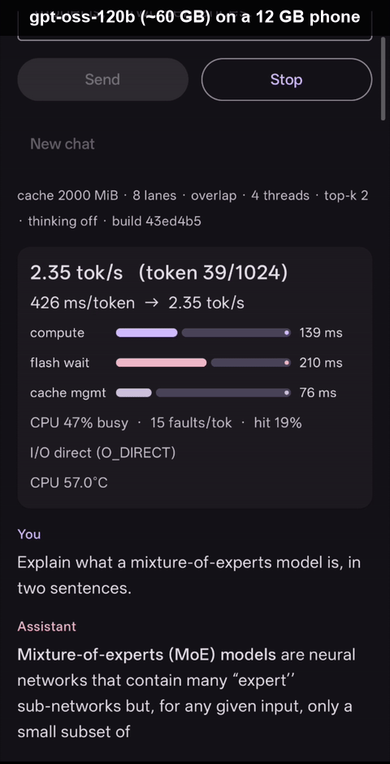

<p align="center">
  <picture>
    <source media="(prefers-color-scheme: dark)" srcset="docs/assets/logo/horizontal-ink.svg">
    
  </picture>
</p>

<p align="center"><b>Run Mixture-of-Experts models bigger than your device's RAM. On a phone, on a PC, CPU only.</b></p>

<p align="center">
  <a href="https://github.com/Helldez/BigMoeOnEdge/releases/latest"></a>
  <a href="https://github.com/Helldez/BigMoeOnEdge/actions/workflows/ci.yml"></a>
  <a href="LICENSE"></a>
</p>

---

A Mixture-of-Experts model is made of many small "experts", and each generated token only uses a
few of them. BigMoeOnEdge takes that literally: it keeps the small always-needed part of the model
at hand and reads just the experts each token asks for, directly from flash storage, at the moment
they are needed. The rest of the model stays on disk. That is what lets a model several times
bigger than your RAM generate text on an ordinary phone, losslessly: the output is byte-identical
to running the same model fully resident.

It is built **on top of llama.cpp's public API**, not as a fork. Every quantization format,
tokenizer and chat template llama.cpp supports works out of the box, because llama.cpp itself is
doing that part: MXFP4 and Q4_K_M stream through the same code. Supporting a new MoE architecture
is one row in a registry, and following a new llama.cpp release is a routine submodule bump.

The most extreme thing it can do today: **gpt-oss-120b**, a ~60 GB model, on a phone with 12 GB of
RAM. Five times more model than memory, generating at **1.3 tok/s** losslessly and **2.2 tok/s**
with one speed knob, against **0.09 tok/s** for the same file loaded the ordinary way.

<p align="center"></p>
<p align="center"><em>gpt-oss-120b (~60 GB) on a 12 GB phone. Real time, not sped up. Full three-model demo below.</em></p>

https://github.com/user-attachments/assets/f899b93f-c7c4-4ce9-9fb0-5ed1bae13761

<p align="center"><em>Left to right: gpt-oss-120b (~60 GB), Qwen3-30B-A3B (18.5 GB), Gemma-4-26B-A4B (17 GB),
recorded in the demo app on a 12 GB phone, real time, not sped up.</em></p>

## Table of contents

- [Why this exists](#why-this-exists)
- [Try it on your phone](#try-it-on-your-phone)
- [Features](#features)
- [Supported models](#supported-models)
- [Benchmarks](#benchmarks)
- [Quickstart](#quickstart)
- [How it works](#how-it-works)
- [Documentation](#documentation)
- [Prior art](#prior-art)
- [License](#license)

## Why this exists

The models people actually want to talk to keep growing faster than the RAM in the devices they
carry. MoE models offer a way out, because most of their weights sit idle on any given token, but
every mainstream runtime still insists on holding (or paging) the whole file in memory. So a 20 GB
model on a 12 GB phone either refuses to load or crawls while the OS frantically swaps.

BigMoeOnEdge treats flash storage as part of the memory hierarchy instead. Three situations where
that changes what your device can run:

**Models far past RAM.** A ~60 GB model on a 12 GB phone cannot be resident, full stop. Streamed,
it runs at usable speed. This is the headline case, but it is not the only one.

**Models just past RAM.** An 18 to 22 GB model on a 12 GB phone is where the ordinary way of
loading (mmap) turns into a fault storm: the OS evicts weights as fast as it reads them, speed
swings wildly, other apps get killed. Streamed, the same model runs stably at up to 5 tok/s,
byte-identical output, and the rest of the phone stays alive.

**Models that barely fit.** Even a model that technically fits in RAM, say an 8B class MoE on a
phone with a few GB free, benefits: loaded the ordinary way it squeezes out everything else, and
the OS claws memory back mid-generation. Streamed with a capped cache, it runs inside a budget you
choose and leaves the system alone. And this is all plain CPU inference: no GPU, no NPU, four
cores and the phone's flash storage.

The same engine builds unmodified on desktop, where a model past RAM streams from the SSD out of
the box. Phones stay the focus, because that is where memory is tightest.

## Try it on your phone

No build needed. Install the APK from the
[latest release](https://github.com/Helldez/BigMoeOnEdge/releases/latest), open the **Get a
model** card, and tap one of the catalog entries: Qwen3-30B-A3B (~18.6 GB), Qwen3.6-35B-A3B
(~22.3 GB) or Gemma-4-26B-A4B (~17 GB), each past most phones' RAM. The catalog is only a
shortcut: the downloader takes any direct gguf URL, so any model from the
[supported architecture families](#supported-models) streams the same way. When the download
finishes, pick the model and chat. The telemetry panel shows tok/s and the compute-vs-flash
split live, and every streaming knob below is in Settings.

Models above Hugging Face's 50 GB per-file limit (gpt-oss-120b, DeepSeek V4 Flash) ship as
multi-shard ggufs. The engine reads split models natively — point it at the first shard
(`-00001-of-...`) with the siblings alongside; no merge step. gpt-oss-120b still needs a manual
copy to the device: steps in the [Android example README](examples/android/README.md#gpt-oss-120b).

## Features

Grouped the way the demo app groups them in Settings.

### Streaming

The core of the engine: `--moe-stream` reads only the experts each token routes to, straight from
flash, bypassing the OS page cache with direct parallel reads (`--io-threads N`). An expert cache
(`--cache-mb N|auto`) keeps the most-used experts in RAM, sized by hand or automatically to the
device; when the model's working set fits it, this is the single biggest speed lever. The
dense-weight policy (`--dense-weights mmap|warm|anon|ahwb`) decides how the always-needed
non-expert weights are held, which becomes the decisive setting far past RAM, where leaving them
to the page cache means the OS keeps re-reading them from flash mid-answer. On Android, `ahwb`
puts them in memory the kernel cannot reclaim at all
([data](docs/bench-data/2026-07-21-pinned-dense-ab/findings.md)). Finally `--overlap` hides flash
latency behind compute, byte-identical output, at the cost of a small optional add-on to llama.cpp
(see [docs/seam.md](docs/seam.md)).

### Speed and quality

Everything above changes *how* weights are fetched, never the math. Two knobs deliberately trade
output quality for speed, and both are measured rather than assumed. `--n-expert-used N` narrows
how many experts each token consults, which cuts compute and reads together. `--drop-cold-experts F`
is more surgical: it skips an expert only when fetching it would cost a flash read *and* the
router barely wanted it, so quality is spent only where it buys I/O. Details and numbers in
[Trading quality for speed](#trading-quality-for-speed).

There is also a routing predictor (`--predict-log`, `--predict-prefetch`) that can guess most of a
layer's experts before the layer runs. Prediction accuracy is proven; reading ahead on it lost its
on-device A/B and ships off. [docs/expert-prediction.md](docs/expert-prediction.md) explains why a
better guess still costs more than it saves.

### Sessions and telemetry

The model stays loaded across chat turns, and every run can account for its own time: `--progress`
breaks each token into flash I/O, cache management and compute, next to the cache hit rate and
bytes read, and `--csv` adds the memory picture those numbers must be read against. The Android
app renders the same feed live while you chat. More under [Telemetry](#telemetry).

### Android demo app

[`examples/android`](examples/android) is a small chat app over the same engine: model downloader,
live telemetry panel, and every knob above in Settings with a one-line note on what it does.
Defaults are the measured winning recipe for a model near RAM.

## Supported models

| Architecture | Reference models | Notes |
|---|---|---|
| `qwen3moe` | Qwen3-30B-A3B and siblings | Shipped default, validated below |
| `qwen35moe` | Qwen3.6-35B-A3B and siblings | Hybrid attention/SSM stack; routed experts stream unchanged |
| `qwen2moe` | Qwen2 MoE family | Same layout as qwen3moe |
| `gemma4` | Gemma 4 MoE (e.g. 26B-A4B) | Fused expert layout, handled by its registry row |
| `gpt-oss` | OpenAI gpt-oss-20b / 120b | Purely routed; MXFP4 weights stream unchanged |
| `lfm2moe` | Liquid AI LFM2 / LFM2.5 MoE (e.g. 8B-A1B) | Hybrid conv/attention stack with leading dense blocks; those stay resident |
| `deepseek4` | DeepSeek V4 Flash (284B-A13B) | V3.2-style routing (256 experts + shared); compressed attention is dense-side; ships multi-shard |

Adding an architecture is one row in the registry; expert counts and layouts are discovered from
the model file at runtime, so nothing about a specific model is hardcoded in the streaming path.
Procedure: [docs/adding-a-model.md](docs/adding-a-model.md). `bmoe-cli --list-archs` prints the
compiled-in set.

## Benchmarks

All figures are measured, not modelled; all models are Q4_K_M.

> **About the numbers.** Measured on one device (12 GB RAM, 11.3 GB usable, UFS 4.x
> storage - **...imagine with UFS 5.x...**) over `adb shell`, 256-token greedy decode. Each number is the best observed for that
> configuration, and rows in a table can come from different benchmark sessions. Phone throughput
> moves a lot with device state (heat, free memory), so the same command can read lower. Full
> method and distributions: [docs/benchmarks.md](docs/benchmarks.md).

**How to read the tables.** Each row is one configuration of the same model on the same phone.
*mmap baseline* is the same file loaded the ordinary way (no streaming), which is what the
streamed rows are compared against. *k* is how many experts each token routes to, i.e.
`n_expert_used` (set with `--n-expert-used`); each table shows the model's default width and,
where measured, a reduced *k*, the measured lossy setting. *Flash/token* is data read from storage
per generated token (lower means the cache is working) and *cache hit* is the share of expert
reads served from RAM instead of flash. Bold marks the best configuration for that model.

### gpt-oss-120b (Q4_K_M): ~60 GB on a 12 GB phone

| Configuration | tok/s | Flash/token | Cache hit |
|---|---:|---:|---:|
| **streamed, k=2, cache 2000 MiB, 8 lanes** | **2.2** | 590 MiB | 32% |
| streamed, k=2, no cache, 4 lanes | 1.8 | 909 MiB | — |
| streamed, default k=4, cache 2000 MiB, 8 lanes | 1.3 | 1292 MiB | 27% |
| streamed, default k=4, no cache, 4 lanes | 0.7 | 1817 MiB | — |
| mmap baseline (no streaming) | 0.09 | — | — |

All streamed rows use `--overlap --dense-weights anon --no-think`. The setting that unlocked this
model is `--dense-weights anon`: this far past RAM the phone keeps reclaiming the always-used
weights mid-generation, and moving them out of the page cache was worth **3.2×** by itself. Note
that `--no-think` disables the model's reasoning and costs quality at k=4; the full matrix and
quality notes are in [docs/benchmarks-gpt-oss.md](docs/benchmarks-gpt-oss.md).

### Qwen3.6-35B-A3B (Q4_K_M): 22.3 GB

A hybrid attention/SSM MoE (256 experts, top-8, 41 blocks): most layers are linear attention
(Gated Delta Net) rather than full attention, and the routed experts stream exactly like a plain
`qwen3moe`. At ~2× device RAM the mmap baseline collapses into a fault storm; streaming with the
dense weights kept out of the page cache (`--dense-weights anon`) runs it stably.

| Configuration | tok/s | Flash/token | Cache hit |
|---|---:|---:|---:|
| mmap baseline (no streaming) | 0.1 (unstable) | — | — |
| streamed, default k=8, cache 2000 MiB, 4 lanes, overlap | 4.3 | 206 MiB | 56% |
| streamed, default k=8, cache 3000 MiB, 4 lanes, overlap | 5.0 | 144 MiB | 65% |
| streamed, k=6, cache 2000 MiB, 4 lanes, overlap | 5.4 | 137 MiB | 60% |
| **streamed, k=6, cache 3000 MiB, 4 lanes, overlap** | **5.8** | 91 MiB | 68% |

All streamed rows use `--overlap --dense-weights anon`. A larger cache is the main lossless lever
(cache 3000 is worth +16% over 2000); the k=6 rows are the measured lossy option (turbo top-k, below),
worth a further ~16% by routing to six experts instead of eight. The lossless best here is cache
3000 at the model's own width, **5.0 tok/s**, output byte-identical to the resident model.

> Unlike the tables above, these Qwen3.6 figures are a single 96-token run rather than the
> 256-token best-of protocol: treat them as indicative, and not strictly comparable to the other
> models until re-measured under the full protocol.

### Qwen3-30B-A3B (Q4_K_M): 18.5 GB

| Configuration | tok/s | Flash/token | Cache hit |
|---|---:|---:|---:|
| mmap baseline (no streaming) | 2.0 (unstable) | — | — |
| streamed, default k=8, no cache, 4 lanes | 1.7 | 1051 MiB | — |
| streamed, default k=8, cache 2000 MiB, 4 lanes | 2.4 | 480 MiB | 53% |
| streamed, default k=8, cache 4000 MiB, 4 lanes | 4.0 | 225 MiB | 76% |
| **streamed, default k=8, auto cache (capped 4000 MiB), 4 lanes, overlap** | **5.2** | 225 MiB | 76% |
| streamed, k=6, cache 4000 MiB, 4 lanes | 5.0 | 165 MiB | 77% |

Cache size is the dominant lever here, and the auto-sized cache with a ceiling
([docs/cache-sizing.md](docs/cache-sizing.md)) is the winning recipe. The mmap baseline
averages ~2 tok/s but swings wildly token to token and evicts other apps. Turbo top-k (k=6) trades
a little quality for a further +24% over the model's own width.

### Gemma-4-26B-A4B (Q4_K_M): 17.0 GB

| Configuration | tok/s | Flash/token | Cache hit |
|---|---:|---:|---:|
| mmap baseline (no streaming) | 0.4 | — | — |
| streamed, default k=8, no cache, 4 lanes | 1.6 | 904 MiB | — |
| streamed, default k=8, cache 2000 MiB, 4 lanes | 2.2 | 366 MiB | 58% |
| streamed, default k=8, cache 2000 MiB, 4 lanes, overlap | 2.8 | 365 MiB | 58% |
| streamed, default k=8, cache 4000 MiB, 4 lanes | 4.1 | 144 MiB | 82% |
| **streamed, k=6, cache 4000 MiB, 4 lanes** | **5.0** | 98 MiB | 83% |

Gemma keeps more of itself permanently resident, so the 4000 MiB cache fits only when enough RAM is
free at launch; cache 2000 + overlap is the dependable everyday setting on this device. Turbo top-k
(k=6) is the fastest here (+22%) but changes the output.

### Trading quality for speed

Every other benchmarked setting changes *how* weights are fetched, never the math. Two knobs change
*what* the model computes, and both are measured:

**Turbo top-k** (`--n-expert-used N`) forces the routing width below the model's own (8 for the
Qwen and Gemma models, 4 for gpt-oss), cutting compute and flash reads together: **+22–24%** on
the Qwen and Gemma models, and gpt-oss goes from 1.3 to **2.2 tok/s** at k=2. It is deterministic,
which is why its `k=6` rows sit in the tables above. But it spends quality indiscriminately: the
routing tail is cut whether or not those experts were already free to run from RAM.

**Cache-aware dropping** (`--drop-cold-experts F`) fixes that: it skips a routed expert only when
it would cost a flash read *and* the router barely weighted it, so quality is spent only where it
buys I/O. Measured at **+55%** on Qwen3.6-35B-A3B at `F = 0.75` (**+84%** at `F = 1.0`), bootstrap
intervals disjoint ([data](docs/bench-data/2026-07-22-drop-cold-experts/findings.md)). Its output
is **not reproducible**, because what gets skipped depends on what the cache held, so it has no
rows in the deterministic tables above. Details: [docs/expert-dropping.md](docs/expert-dropping.md).

On quality itself: a 15-question GSM8K check found no loss from dropping at any threshold
([data](docs/bench-data/2026-07-22-drop-quality/findings.md)); a sample that size rules out a
collapse, not a subtle cost. Judge either knob on your own task before relying on it.

### What to expect in the app

The tables above are a benchmark protocol over `adb`, not a chat session. The demo app lands close:
the best gpt-oss config reads **1.9 tok/s** in the app against 2.2 over adb, about 13% below. The
gap is the protocol (short chat replies never fully warm the cache), not the app. The app's
telemetry panel reports the same fields as the CLI, so you can see it directly. Analysis:
[docs/warmup-analysis.md](docs/warmup-analysis.md).

### Desktop

The same engine builds and runs unmodified on desktop, and a >RAM model streams out of the box.
Measured on a Windows x86 laptop (8 cores, 16 GB RAM, dual-channel DDR4, NVMe SSD) with
Qwen3.6-35B-A3B at ~1.5× RAM, 256-token generations:

| Configuration | tok/s | Flash/token | Cache hit |
|---|---:|---:|---:|
| streamed, default k=8, cache auto, 4 lanes | 4.8 | 74 MiB | 84% |
| streamed + `--drop-cold-experts 0.75` | 6.8 | 23 MiB | 92% |
| **streamed + `--overlap` + `--drop-cold-experts 0.75`** | **7.3** | 24 MiB | 92% |

The interesting part is that the bottleneck **flips**: on the phone streamed decode is I/O-bound,
on this laptop it is DRAM-bandwidth-bound in compute (~0.11 s/token in every cell → a ~9 tok/s
ceiling even at zero I/O). More io lanes, more compute threads and the ~3 GB/s NVMe are all
neutral; the levers that pay are the cache budget, cache-aware dropping and `--overlap`. Full
campaign, including the cache-auto confound that round 1 had to unwind:
[docs/bench-data/2026-07-24-desktop-qwen36](docs/bench-data/2026-07-24-desktop-qwen36/findings.md).

Mobile stays the target and desktop is not tuned beyond this. If the model fits in RAM, just run
it resident.

### How this is tested, and where the numbers come from

Three kinds of evidence, kept apart on purpose: correctness is asserted, speed and quality are
measured, and neither is allowed to stand in for the other.

**Correctness is a gate, not a benchmark.** `ctest` runs byte-identity gates on a tiny synthetic MoE
model generated by [`scripts/make-tiny-moe.py`](scripts/make-tiny-moe.py): streaming only the routed
experts must produce output *identical* to running with every expert resident, and the same holds
across the LRU cache, evictions, the `--overlap` async path, temporal prefetch, the dense-weight
rebind, and multi-turn sessions. A lossy knob gets gates for its machinery instead: that changing
where the engine loads did not itself change a byte, which is what separates "the plumbing is
correct" from "the setting is lossy".

**Speed is measured on device**, over `adb shell` or in the demo app, one variable at a time, with
the raw per-token CSVs committed under [`docs/bench-data/`](docs/bench-data) next to a `findings.md`
that states the caveats: run order, thermal state, and what the cell does *not* show. Confidence
intervals are bootstrapped over the per-token series rather than quoted from a single mean. Method:
[docs/benchmark-method.md](docs/benchmark-method.md).

**Quality, for the lossy settings, is checked against a public benchmark.** The
[cache-aware dropping check](docs/bench-data/2026-07-22-drop-quality/findings.md) uses 15 questions
taken verbatim from the **GSM8K** test split
([openai/grade-school-math](https://github.com/openai/grade-school-math), MIT), with the grading rule
fixed before any output was read and every reply committed so the grading can be audited. Decoding
is greedy throughout, so there is no sampling noise: a difference between two cells is caused by the
setting, not by chance. At that sample size such a check rules out a collapse, not a subtle cost, and
the write-ups say so.

Anything not measured is named as unmeasured. That is the rule the roadmap's
[recorded negative results](docs/roadmap.md) exist to enforce: a simulation that predicted a win and
a device that then delivered a 30% loss is why nothing here is published on an argument alone.

## Quickstart

### Host (Linux, macOS, Windows)

```bash
git clone --recursive https://github.com/Helldez/BigMoeOnEdge.git
cd BigMoeOnEdge
scripts/build-host.sh

# stream a MoE model with a device-sized expert cache and 4 read lanes
build/cli/bmoe-cli -m Qwen3-30B-A3B-Q4_K_M.gguf --moe-stream \
  --cache-mb auto --cache-ceil-mb 4000 --io-threads 4 -t 4 -n 48 \
  --chatml -p "Explain MoE routing."
```

For a model several × device RAM, the shape that produced the gpt-oss numbers is:

```bash
build/cli/bmoe-cli -m gpt-oss-120b-Q4_K_M.gguf --moe-stream --overlap \
  --dense-weights anon --cache-mb 2000 --io-threads 8 -t 4 -n 256 \
  --chatml --no-think -p "Explain MoE routing."
```

The model must live on a real filesystem (on Android `/data/local/tmp/...`, not `/sdcard`). Omit
`--moe-stream` for the plain mmap baseline. The byte-identity gates (streamed == resident) run with
`cd build && ctest --output-on-failure` (needs `python3` with the `gguf` package).

Platform status: Linux is exercised by CI (build + gates) and Windows is where the
[desktop numbers](#desktop) were measured. On Windows, build with CMake directly (Visual Studio
Build Tools); the script above is bash, and MSVC puts the binary in `build\cli\Release\bmoe-cli.exe`.
macOS builds from the same sources (the platform branches exist) but is not validated, and it has
no O_DIRECT, so direct reads fall back to buffered I/O there.

### Android

The demo app is in [`examples/android`](examples/android): build the CLI for arm64 with
`scripts/build-android.ps1`, build the APK, push a model. Settings expose every streaming knob with
a one-line note on what it does; defaults are the measured winning recipe for a model near RAM. For
a model several × RAM, switch the dense-weights policy to `anon` and give the cache a real budget.
A prebuilt debug APK is attached to each
[release](https://github.com/Helldez/BigMoeOnEdge/releases).

## How it works

The model loads file-backed, and the engine hooks llama.cpp's public evaluation callback. When a
layer picks its experts for the current token, the engine fetches exactly those slices from flash
just in time for the matmul, optionally caching the hottest ones and overlapping reads with
compute. No llama.cpp sources are modified. The one exception is the optional `--overlap` flag,
which needs a per-expert wait point inside the CPU MoE kernel that no public API exposes: it
carries a single ~25-line hook, as one commit on the fork branch `bmoe/expert-ready-hook`. The
hook is zero-cost when unregistered, everything else builds against stock upstream, and it is
dropped the moment upstream ships an equivalent. Design and the exact API contract:
[docs/architecture.md](docs/architecture.md), [docs/seam.md](docs/seam.md).

### Telemetry

A model streamed past RAM fails in ways that all look identical from outside: it's just slow. So
every run accounts for its own time. `--progress` breaks each token down into flash I/O, cache
management and compute, next to the cache hit rate and the bytes read; `--csv` adds the memory
picture those numbers have to be read against. The Android app renders the same feed live while you
chat, which is how you watch a phone quietly take its memory back mid-answer.

What makes it worth reading is that the engine is candid about its own numbers. Compute, in
particular, isn't measured: it's whatever time is left once the measured parts come out, so it
silently absorbs page faults and throttled cores. Rather than let that pass, the engine ships the
counters that pull the residual apart, and marks anything it couldn't measure as unmeasured instead
of quietly reporting zero. That candour extends to the headline: tok/s times the decode and nothing
else, so the sampling, detokenizing and rendering between one token and the next fall outside it;
the engine reports that time too, rather than letting work hide in the gap.

Every metrics file also states the run that produced it: the engine version and the full resolved
configuration, including whether the run was instrumented or sampled, because such a run is not a
benchmark run. Two files put side by side answer "which is faster" only if something says what
differed between them, and by the time a file is read the command line that made it is long gone.

When the per-token split isn't enough, two diagnostics go further: one records what the router
asked for on every token, the other times the compute graph node by node. Both perturb the run they
measure, and both say so.

Formats and schemas: [docs/telemetry.md](docs/telemetry.md).

## Documentation

[docs/](docs/README.md) is indexed by what you're trying to do: understand the design, extend it,
or reproduce the measurements. Most-wanted entry points:

- [docs/architecture.md](docs/architecture.md): the layer map and the llama.cpp relationship.
- [docs/adding-a-model.md](docs/adding-a-model.md): supporting a new MoE architecture.
- [docs/benchmarks.md](docs/benchmarks.md): measured results and
  [how they were produced](docs/benchmark-method.md).
- [docs/telemetry.md](docs/telemetry.md): the per-token line protocol, the CSV schema and the traces.
- [docs/android-memory.md](docs/android-memory.md): what reclaims the engine's memory on a phone.

## Prior art

This is an engineering package of ideas from AirLLM, Apple's *LLM in a flash*, FlexGen, PowerInfer
and EdgeMoE, not a novel technique. The closest recent work is
[flash-moe](https://github.com/danveloper/flash-moe): a purpose-built Metal engine that streams a
397B MoE from SSD on Apple Silicon, and on an iPhone through a community fork. BigMoeOnEdge takes
the other side of that problem: CPU-only, on Android, on llama.cpp's public API (bar one optional
~25-line hook, above), across architectures. See [docs/limitations.md](docs/limitations.md).

## License

Apache-2.0. See [LICENSE](LICENSE).
